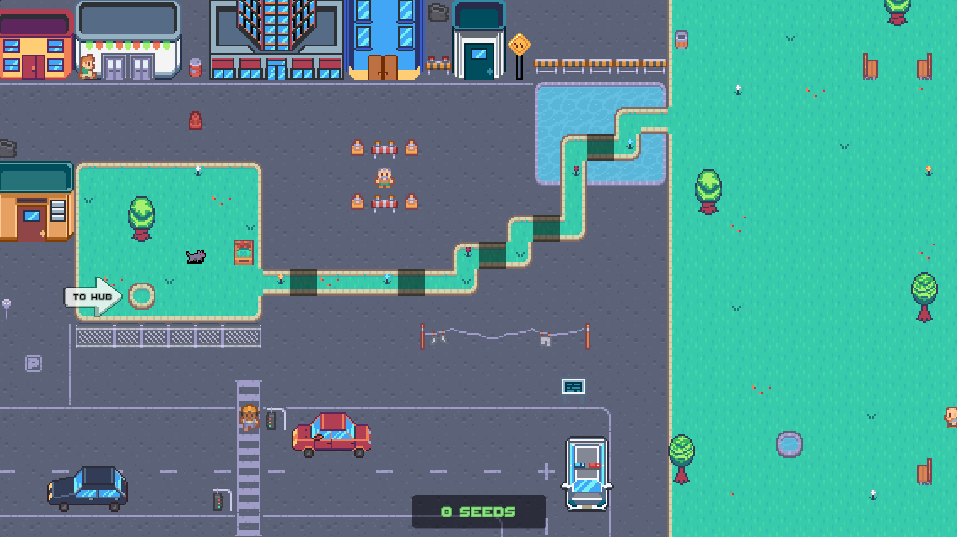
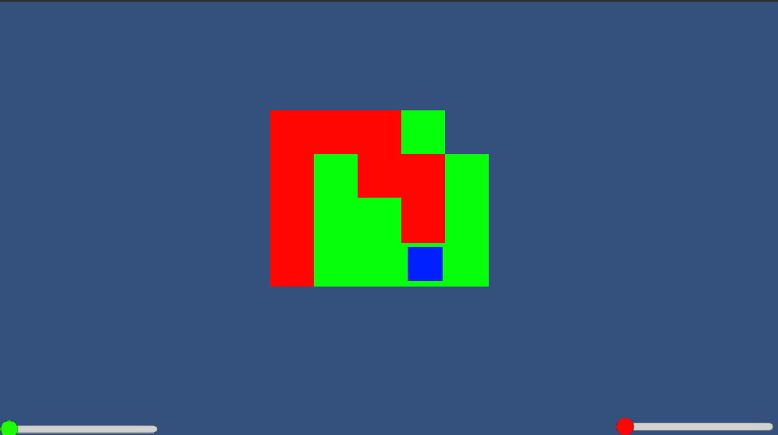
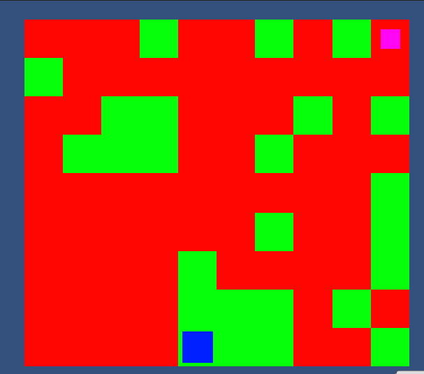
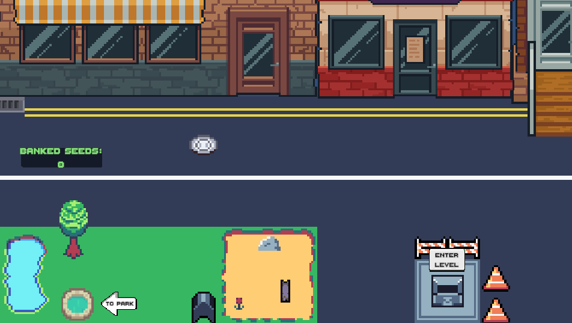
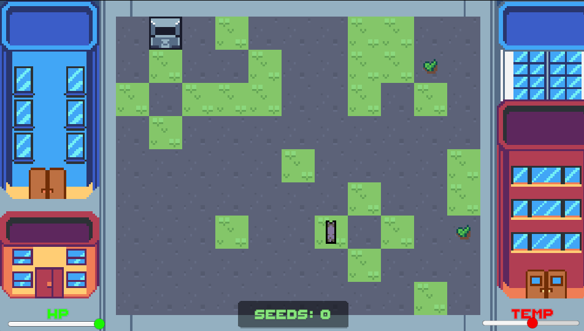
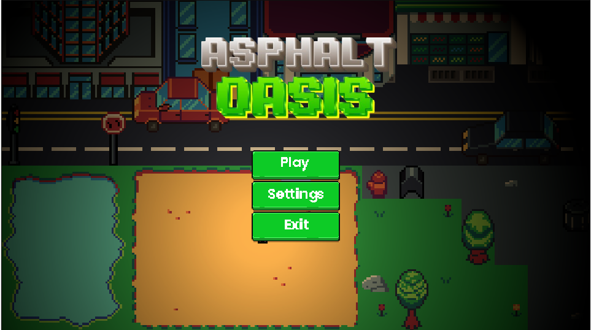
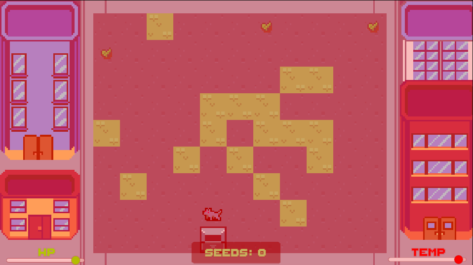
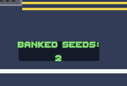

# Asphalt Oasis — RSA Reflective Report

---

## 1. Project Overview

This game was based on a brief from the RSA Student Design Awards, which provided multiple briefs to choose from. The brief I went with was the 'Made Natural' brief: How might we create sustainable, nature-based solutions which use trees to protect the environment and strengthen communities? (RSA Student Design Awards 2023–24 Toolkit, 2021).

The game is centred on one main issue the brief encompasses: Urban Heat Islands. When you have large cities dominated by concrete infrastructure, they trap and radiate heat. Research shows that cities worldwide are warming at twice the global average rate due to the urban heat island effect (Campbell et al., 2021). The solution to this is what is known as green corridors, which are continuous strips of vegetation and plant-based wildlife that connect natural habitats, support plant and wildlife migration, and cool urban areas.

This real-world solution is what my game aims to showcase and model for players, in the hope of educating them about real-world issues. Green corridors also promote SDG 11 (United Nations, 2015), specifically points 11.1 and 11.3 (Fateen Nabilla Rasli et al., 2025), as they provide safe, resilient, and sustainable urban spaces through their natural defences against the urban heat island effect, thereby creating adequate and safe housing for people.

In my game Asphalt Oasis, you play as a dog that must navigate a concrete city, collecting seeds whilst managing rising body temperatures due to the urban heat island effect. To beat the game, you must then take the seeds and plant them to unlock and grow a green corridor pathway back to the main park (see Figure 1). This serves as a direct metaphor for the real-world purpose and solution of green corridors, creating a meaningful link between the game and real-world issues rather than relying on basic themes or visuals (Bogost, 2007).

I believe this game was the right medium to highlight these issues, as it targets audiences aged 12–22 who are connected to the internet and understand these issues. Still, they may be unaware of their real impact or feel that anything they do will not make a difference. This game aims to provide them with agency and to show them that even small actions, such as planting a single seed at a time, can create tangible change (Squire, 2021).



*Figure 1: Image of the game's park area with the pathway locked*

---

## 2. Development Process

Before I started any work on the game, I planned how I would approach development over my 12-week window. I was going to work through three main phases, starting with a grey-box prototype, then adding visuals into a vertical slice of the game, and finally testing, fixing bugs, and adding the final polish, making sure I get the mechanics and features implemented before I add art and extra visuals (Gibson Bond, 2022).

**Phase 1** - I established the core game systems. Tile-by-tile grid movement via a `PlayerController` script, and the temperature and health system in my `PlayerStats` script that used C# events, so my UI could react to stat changes without being tightly coupled to the player scripts (see Figure 2).



*Figure 2: Early prototype of the game with a small level and basic health and temperature bars*

```csharp
public event Action<float> OnHealthChanged;
public event Action<float> OnTemperatureChanged;
```

I created an early version of my `LevelGenerator` script that places tiles procedurally (see Figure 3). This meant that the core loop of the game was established before moving on to extra features and visuals (Schell, 2018).



*Figure 3: A more advanced level prototype that's larger and showcases a purple seed item in its early stages*

**Phase 2** — This is where I began fleshing out the game, adding more quality-of-life features and visuals, and building on the foundation I laid in Phase 1. I designed the Hub and Garden scenes (see Figures 1 and 4). This is where I connected the seed economy to the path progression system via scripts such as `PathTile`, `PathManager`, and `PlantingStation`. A `GameManager` script was created to persist across all scenes and track seeds and path progress without being destroyed when switching levels.

```csharp
if (Instance == null)
{
    Instance = this;
    DontDestroyOnLoad(gameObject);
    LoadProgress();
}
else { Destroy(gameObject); }
```



*Figure 4: Image of the game's hub area with seed count and directions to the park and level*

I populated the levels and scenes with assets as well. Due to my lack of artistry, I used some I found online (Kenney, 2019), so each scene now had a visually polished feel, and the actual level used seed sprites, grass and concrete tiles rather than the old red and green squares (see Figure 5).



*Figure 5: Image of the game's procedural level showcasing updated assets for tiles and seeds, and the new UI bars and seed bank*

Now that you could collect seeds in the game and plant them to unlock your path back to the park, I was ready to move on to Phase 3.

**Phase 3** — This was the final phase of production and development before release. Here, I added the main and pause menus to the game (see Figure 6) and included all the small UI elements that bring the game together, such as the seed counter and the red damage vignette that appears when you start to lose health.



*Figure 6: Image of the game's main menu and logo*

The game was in an almost-ready state, so I sent it to a few friends to playtest and got a lot of helpful feedback on how to improve it.

The main issues identified in the playtest were:

- The difficulty was unbalanced and too easy
- Movement in non-level areas felt slow and unintuitive
- UI sync bug caused the hub seed counter to display incorrect data
- The pause menu would not appear when the key was pressed
- The new game function failed to reset player progress

Throughout the development process, I used GitHub for version control, branching out when testing new features and writing commit summaries to keep me informed about the session's work and what I changed in case something broke.

---

## 3. Feedback and Iteration

I started playtesting once I had the game in a semi-polished state. I built a prototype of the game, wrote a short instruction document explaining how to play it, and sent it to five people I know who are experienced video game players and fit the target demographic. This approach aligns with Fullerton's (2019) playcentric methodology, which emphasises testing with real players as early as possible to identify issues that internal testing cannot surface.

The main goal of this playtest was to test whether the game's core loop was fun at its base level, whether the mechanics were clear and easy to use, and to find any bugs I had not caught myself when testing in the editor.

These were the issues that were highlighted to me and how I fixed them:

**Heat damage was being applied for too long** — When players reached the temperature threshold and started losing health, because the damage was escalating, even if they cooled down below the damage threshold, they would still take damage and, in most cases, die. This was fixed by introducing a cooldown buffer in `PlayerStats` so that damage stops once the temperature has dropped below the desired threshold, rather than stacking and staying active (see Figure 7).

```csharp
if (temperature < damageTempThreshold - cooldownTempBuffer)
{
    _isTakingHeatDamage = false;
    _heatTimer = 0f;
}
```



*Figure 7: Image displaying the red health vignette that's applied when the player is too hot and takes damage*

**Hub seed counter not updating** — `HubUISync` was reading the seed count from my `GameManager` script only once at the start, so it did not update when the seed count changed, as it ran only once per game. This was fixed by having the script listen to the `OnBankUpdated` event and refresh the count whenever the seed count changed (see Figure 8).



*Figure 8: Image displaying the updated seed bank UI in the hub*

**New game button not resetting player progress** — The button would wipe the values in the game's open memory but would not wipe the data from the stored `PlayerPrefs` file, causing the game to use the file as the saved data and the button to not function properly. I fixed this by adding a method to the button's script that deleted the game save keys in the `PlayerPrefs` file, so when the script was called it returned the default values, effectively resetting the game.

**Clunky movement outside the levels** — This was not a bug, but rather player feedback. Since the game is a tile hopper, you are limited to one-tile jumps to navigate. However, in the hub and park levels, this made the game feel slow and clunky. This was fixed by splitting the `PlayerController` script into two modes: one that uses `GetKeyDown` for tile-by-tile movement and another that uses `GetKey` for continuous, smooth movement in the hub.

```csharp
if (useGridStepMovement)
{
    // Level behaviour -- one press = one tile
    if (Input.GetKeyDown(KeyCode.W))      moveDir = Vector2Int.up;
    else if (Input.GetKeyDown(KeyCode.S)) moveDir = Vector2Int.down;
    else if (Input.GetKeyDown(KeyCode.A)) moveDir = Vector2Int.left;
    else if (Input.GetKeyDown(KeyCode.D)) moveDir = Vector2Int.right;
}
else
{
    // Hub behaviour -- hold to move
    if (Input.GetKey(KeyCode.W))      moveDir = Vector2Int.up;
    else if (Input.GetKey(KeyCode.S)) moveDir = Vector2Int.down;
    else if (Input.GetKey(KeyCode.A)) moveDir = Vector2Int.left;
    else if (Input.GetKey(KeyCode.D)) moveDir = Vector2Int.right;
}
```

**Difficulty and feel** — This was the final point raised in the player feedback, as the overall opinion was that the game is too easy and that damage and heat are not enough of a deterrent to make planning your path and using the grass tiles rewarding. This was hard to fix, as it required extensive fine-tuning to balance properly. In the end, I increased the rate of heat-up and the damage, but also capped how high the damage can scale, so you heat up to the damage threshold quicker and take more damage. Still, it will not stack as high over time, providing a more balanced feel to the gameplay and a greater difficulty when playing through.

Schell (2018) describes the optimal play state as a 'flow channel' in which the game's challenge and the player's skill are evenly matched. The initial version of the game fell below this threshold for playtesters, enabling them to identify the small changes needed to improve it and make it release-ready.

This process highlighted to me that, as a developer, I had become blind to certain areas based on my own assumptions, particularly around game difficulty. Because I had created all these systems, I understood them and knew how to play the game with them, which led me to underestimate the possibility that a new player could ignore them completely. Fullerton (2019) refers to this as a core reason why playtesting with outside participants is essential, and that developers cannot reliably test their own games because their familiarity masks the friction that some aspects of the game can cause. In future projects, I would set up and structure my playtesting earlier and in a more formal way to catch these issues in the early stages of development.

---

## 4. Critical Reflection

The process of developing Asphalt Oasis was a mixture of positives and negatives, with not everything going exactly to the plan and structure I created and followed throughout.

The main highlights and decisions throughout the development process consisted of a few key items. The decision to utilise heat as the main threat worked well, turning an everyday aspect of life into a meaningful exploration of how dangerous it can be, especially for other animals and wildlife that are less durable than we are. Because temperature rises when in contact with the concrete tiles, players are forced to constantly reroute themselves and make meaningful decisions in their gameplay without feeling arbitrarily punished, a concept explored by Schell (2018) as a core element of good game feel.

Another win during production was decoupling my scripts, which is normally an issue for me. When writing my code, I separated the logic and features into their own individual scripts to avoid dependencies between them. If scripts needed to react to or read from other scripts, I used the technique of subscribing to the individual methods needed, so only that specific information was used, not the entire script. For example, the Heat Vignette, when taking damage, was handled via an observer pattern in `PlayerStats` that only read the temperature and compared it to the damage threshold, which then dictated when to apply the vignette.

Finally, the other major achievement was the `LevelGenerator` script, as it was my first time creating a system like this. The generator would take my tile set and seeds, and I could input parameters such as how many seeds per level, how far I wanted the seeds to spawn from the exit and the player spawn, and the ratio of grass to concrete tiles. In the end, I got the system working properly and, in doing so, made the game infinitely replayable, as every level is unique, which also saved me hours of manual level design and creation.

Not everything worked perfectly or went according to plan, as I was rather ambitious with the game's scope in the planning phase of this project, wanting to include a day/night cycle, a food and water system, and a wider array of tiles and item pickups. Removing these features was a deliberate decision I had to make in the first phase of development, as they would increase the development time by a large margin since I would have had to add in a dynamic lighting system on a timer for the day cycle, along with many more scripts and assets for the other features. Simplifying the resource to only seeds also improved the game by removing the potential issue of players splitting their focus between seeds and food. As Gibson Bond (2022) argues, there is significant value in cutting features that do not serve the game's core loop and instead prioritising the essential systems.

Overall, I believe that during the development process, I made the correct decisions throughout to prioritise completing the game in its core state. Reducing the scope of the game and using outside art assets were just a few choices that shaped my workflow. At its core, it works and plays well. However, the message about urban heat islands and green corridors may not communicate as effectively in the current game as I had planned. This could have been fixed by adding a tutorial that included some expositional dialogue to help the user understand what they are achieving during their own playtime.

---

## 5. Evaluation of Impact

The original proposal for the game set out to show players that small individual actions, such as planting one seed at a time, can create meaningful environmental change and, especially for younger players, provide a sense of agency over an issue that normally feels too large to have a personal impact. Mechanically, the game does achieve this to a degree. Planting each seed visually advances your path towards the park and safety, which adds weight to the actions in the game.

It does, however, fall short in properly framing the overall concept and relies on players to link the gameplay to the current issues that wildlife faces in urban areas and built-up cities due to the urban heat island effect (Campbell et al., 2021). The heat and temperature mechanic accurately depicts, in a condensed way, the problem of concrete structures warming the surrounding area and how green corridors can be an alleviating solution (Fateen Nabilla Rasli et al., 2025). Most players would not grasp the nuance behind this, though, and would walk away with a surface-level view that animals struggle to regulate their heat on concrete rather than understand the root cause.

When looking at the SDG 11 targets, the game also addresses them, focusing more on targets 11.1 and 11.3 (United Nations, 2015). Target 11.1 concerns access to safe and affordable housing and public spaces, which the game mirrors by creating a safe place to live for the animal protagonist and helping them get back to the park. Target 11.3 is more present throughout the game, as it is about inclusive and sustainable urbanisation. This is shown in the game by promoting the use of wildlife and greenery to provide a better quality of life for everyone, including animals and plant life.

---

## 6. Future Directions

This game has a lot of room to grow, and I have a few ideas I would implement right away. The scrapped day/night system could be reworked and added, as it would enhance visuals but could also alter how you play: at night, it is cooler, but reduced heating risk comes with poor visibility, making it harder to see every tile in a level. I would also add scaling difficulty with larger levels, so the further you progress, the larger levels you traverse, perhaps with added obstacles and other items.

A tutorial or introduction that outlines the core gameplay whilst providing educational notes on the issues the game addresses would be highly beneficial, as players on console or Steam will not have access to a readme file before playing. This closes the gap addressed in both the critical and impact evaluations and cements the game's purpose more clearly than relying on the player to infer it from context (Squire, 2021).

Adding some accessibility features would be beneficial as well, since the current setup makes the tiles' main distinction colour. There are sprite and texture differences, but providing some colourblind-friendly options could expand the player base. Remappable controls fall under this, as not everyone can use a keyboard, so wider input support and input remapping would be added.

Before real-world deployment, I would focus on improving the visuals and feel of the game by adding in animations and assets for the path unlocks, as opposed to the current black squares fading away, plus some improved assets and animations would allow for a wider variation of level designs to keep gameplay fresh.

Finally, I would investigate deployment in real-world scenarios. The game would be published on both PC and console platforms worldwide for players to download. Another direction I could take in the future would be for educational use in schools, targeting the 12–16 age range specifically, as this is the exact demographic many environmental organisations want to reach but often struggle to. Gaming is a great medium to pass this message along (Squire, 2021). The game would be altered for educational purposes with more detailed explanations on the game's theming and perhaps an integrated guide showcasing how you are positively affecting the area and tackling the urban heat island issues as you play, turning what is normally a difficult subject into a fun, interactive session that promotes teamwork and class discussion (Campbell et al., 2021).

---

## References

Bogost, I. (2007) *Persuasive Games: The Expressive Power of Videogames*. Cambridge, MA: MIT Press.

Campbell, I., Sachar, S., Meisel, J. and Nanavatty, R. (2021) *Beating the Heat: A Sustainable Cooling Handbook for Cities*. Nairobi: United Nations Environment Programme.

Fateen Nabilla Rasli, Juhari, M.L. and Halim, A. (2025) Green Corridors in Coordinating and Supporting SDG 11: Sustainable Cities and Communities. *International Journal of Research and Innovation in Social Science*, VIII(XII), pp.1053–1071. Available at: https://doi.org/10.47772/ijriss.2024.8120089 [Accessed 18 February 2025].

Fullerton, T. (2019) *Game Design Workshop: A Playcentric Approach to Creating Innovative Games*. Boca Raton: CRC Press.

Gibson Bond, J. (2022) *Introduction to Game Design, Prototyping, and Development*. 2nd edn. Boston: Addison-Wesley Professional.

Kenney (2019) *RPG Urban Pack*. Available at: https://kenney.nl/assets/rpg-urban-pack [Accessed 26 May 2026].

RSA Student Design Awards 2023–24 Toolkit (2021) *Miro.com*. Available at: https://miro.com/app/board/uXjVM2Ecgzs= [Accessed 26 May 2026].

Schell, J. (2018) *The Art of Game Design: A Book of Lenses*. 3rd edn. Boca Raton: CRC Press.

Squire, K. (2021) *Making Games for Impact*. Cambridge, MA: MIT Press.

United Nations (2015) *Goal 11: Make Cities and Human Settlements Inclusive, Safe, Resilient and Sustainable*. Available at: https://sdgs.un.org/goals/goal11#targets_and_indicators [Accessed 26 May 2026].

---

## Appendix

### RSA Project Images


*Figure 1: Image of the game's park area with the pathway locked*


*Figure 2: Early prototype of the game with a small level and basic health and temperature bars*


*Figure 3: A more advanced level prototype that's larger and showcases a purple seed item in its early stages*


*Figure 4: Image of the game's hub area with seed count and directions to the park and level*


*Figure 5: Image of the game's procedural level showcasing updated assets for tiles and seeds, and the new UI bars and seed bank*


*Figure 6: Image of the game's main menu and logo*


*Figure 7: Image displaying the red health vignette that's applied when the player is too hot and takes damage*


*Figure 8: Image displaying the updated seed bank UI in the hub*

---

### Playtesting Session

**Format:** Verbal feedback via voice call

**Key feedback received:**

- Heat damage felt unfair and difficult to recover from
- Hub movement felt slow and clunky
- Game was too easy overall
- No way to pause the game
